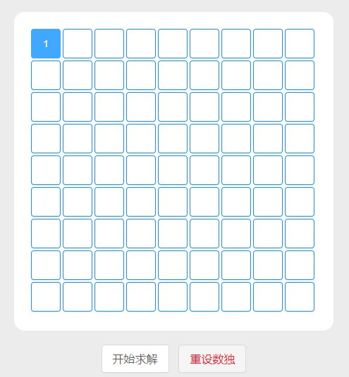
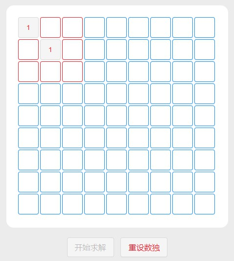

# Sudoku

## 部署后的项目

[demo](http://sudoku.youggls.top)

## Build Setup

* 开发环境部署：`npm run dev`

* 生产环境部署：`npm run build`，将dist文件夹拷贝到nginx代理目录下

## 注意事项

1. 由于没有做移动端适配，请确保您的设备横向分辨率大于1300px

2. 输入数字方法：点击一个框，按下大键盘数字键，输入成功即可发现相应数字框变蓝

3. 撤销输入方法：点击数字框，按退格键即可

4. 若有不合法输入，不合法所在在的块（行、列）会变红，按照3的方法重新输入即可

## 附

